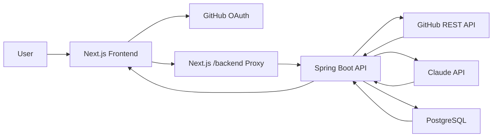

# GitHub PR Reviewer

GitHub PR Reviewer is a full-stack AI code review application for GitHub pull requests. Users sign in with GitHub, choose an open pull request, and receive AI-generated review comments grouped by severity with suggested fixes.

The project is built with:

- Spring Boot backend
- Next.js frontend
- PostgreSQL database
- GitHub REST API
- Claude API for AI code review
- GitHub OAuth for sign-in

## Table Of Contents

- [Features](#features)
- [How It Works](#how-it-works)
- [Architecture](#architecture)
- [Screenshots](#screenshots)
- [Tech Stack](#tech-stack)
- [Project Structure](#project-structure)
- [Local Setup](#local-setup)
- [Environment Variables](#environment-variables)
- [GitHub OAuth Setup](#github-oauth-setup)
- [Running The App](#running-the-app)
- [API Reference](#api-reference)
- [Testing](#testing)
- [Troubleshooting](#troubleshooting)
- [Future Improvements](#future-improvements)

## Features

### Implemented

- GitHub OAuth sign-in
- Signed session cookie
- Idle session timeout after 30 minutes without activity
- Logout support
- Owner field auto-filled from authenticated GitHub account
- Owner field disabled after login
- Open pull request review only
- Merged and closed pull requests are rejected
- GitHub PR details fetch
- GitHub PR changed files fetch
- Claude-powered code review
- Review result persistence in PostgreSQL
- Cached review results for already-reviewed open PRs
- Force refresh support
- Review comments grouped by severity:
  - Critical
  - Warning
  - Suggestion
- Review comments include:
  - File name
  - Line number
  - Issue
  - Suggested fix
  - Category
- Review result summary dashboard
- Frontend proxy route to avoid browser CORS issues
- GitHub webhook endpoint
- Custom app title and favicon

## How It Works

1. User opens the frontend.
2. User signs in with GitHub.
3. The app stores a signed session cookie.
4. The frontend reads the session and fills the owner field from the GitHub username.
5. User enters repository name and pull request number.
6. Backend checks that:
   - GitHub user exists
   - Repository exists
   - Pull request exists
   - Pull request is open
7. Backend fetches changed files from GitHub.
8. Backend sends code patches to Claude.
9. Claude returns review comments.
10. Backend stores review data in PostgreSQL.
11. Frontend displays grouped review results.
12. Backend can post review comments back to the GitHub PR.

## Architecture



## Screenshots

Screenshots should be added after GitHub OAuth credentials are configured locally, because the main app screen now requires login.

Recommended screenshot files:

```text
docs/screenshots/login.png
docs/screenshots/review-dashboard.png
docs/screenshots/review-results.png
```

Recommended Markdown once screenshots are captured:

```md


```

## Tech Stack

### Frontend

- Next.js 16
- React 19
- TypeScript
- Tailwind CSS
- Lucide React icons
- Axios

### Backend

- Java 17
- Spring Boot 3.2.5
- Spring Web
- Spring WebFlux
- Spring Data JPA
- PostgreSQL
- Lombok
- Maven

### External Services

- GitHub REST API
- GitHub OAuth
- Claude API

## Project Structure

```text
ai-code-reviewer/
  frontend/
    app/
      auth/
        github/
          route.ts
          callback/route.ts
        logout/route.ts
        session/route.ts
      backend/[...path]/route.ts
      page.tsx
      layout.tsx
      icon.svg
      apple-icon.svg
    components/
    lib/
      api.ts
      auth.ts
    package.json
  src/main/java/com/shivam/aicodereviewer/
    config/
    controller/
    dto/
    exception/
    model/
    repository/
    service/
  src/main/resources/
    application.yml
  pom.xml
```

## Local Setup

### Prerequisites

Install:

- Java 17
- Maven
- Node.js
- npm
- PostgreSQL
- Git

You also need:

- GitHub personal access token
- GitHub OAuth App
- Claude API key
- PostgreSQL database

## Environment Variables

### Backend

Create a root `.env` file:

```env
DATABASE_URL=jdbc:postgresql://localhost:5432/ai_code_reviewer
DATABASE_USERNAME=your_database_username
DATABASE_PASSWORD=your_database_password

GITHUB_TOKEN=your_github_personal_access_token
GITHUB_WEBHOOK_SECRET=your_webhook_secret

CLAUDE_API_KEY=your_claude_api_key
```

The backend reads these values in `src/main/resources/application.yml`.

### Frontend

Create `frontend/.env.local`:

```env
NEXT_PUBLIC_API_URL=http://localhost:8080
NEXT_PUBLIC_APP_URL=http://localhost:3000
GITHUB_CLIENT_ID=your_github_oauth_client_id
GITHUB_CLIENT_SECRET=your_github_oauth_client_secret
AUTH_SECRET=replace_with_a_long_random_string
```

`AUTH_SECRET` signs the session cookie. Use a long random value.
`NEXT_PUBLIC_APP_URL` must exactly match the URL used in the GitHub OAuth callback.

## GitHub OAuth Setup

Create a GitHub OAuth App:

1. Open GitHub.
2. Go to `Settings`.
3. Go to `Developer settings`.
4. Open `OAuth Apps`.
5. Click `New OAuth App`.
6. Use these local values:

```text
Application name: GitHub PR Reviewer
Homepage URL: http://localhost:3000
Authorization callback URL: http://localhost:3000/auth/github/callback
```

Copy the Client ID and Client Secret into `frontend/.env.local`.

Important: GitHub requires the callback URL to match exactly. These are different URLs:

```text
http://localhost:3000/auth/github/callback
http://127.0.0.1:3000/auth/github/callback
```

If your OAuth App uses `localhost`, open the app at `http://localhost:3000` and set:

```env
NEXT_PUBLIC_APP_URL=http://localhost:3000
```

## Running The App

### Start Backend

From the project root:

```bash
mvn spring-boot:run
```

Backend runs at:

```text
http://localhost:8080
```

Health check:

```text
http://localhost:8080/health
```

### Start Frontend

From `frontend/`:

```bash
npm install
npm run dev
```

Frontend runs at:

```text
http://localhost:3000
```

The frontend proxies backend calls through:

```text
http://localhost:3000/backend
```

## API Reference

### Health

```http
GET /health
```

Returns:

```text
Working Application
```

### Analyze Pull Request

```http
POST /api/review/analyze?owner={owner}&repo={repo}&prNumber={prNumber}&forceRefresh=false
```

Rules:

- User must exist.
- Repository must exist.
- Pull request must exist.
- Pull request must be open.
- Closed and merged pull requests are rejected.

### Get Review Comments

```http
GET /api/review/{reviewId}/comments
```

Returns review comments grouped by frontend logic.

### Get Review History

```http
GET /api/review/reviews?repoName={owner}/{repo}
```

### Test GitHub PR Details

```http
GET /api/review/test?owner={owner}&repo={repo}&prNumber={prNumber}
```

### Test PR Files

```http
GET /api/review/files?owner={owner}&repo={repo}&prNumber={prNumber}
```

### GitHub Webhook

```http
POST /webhook/github
```

## Frontend Auth Routes

### Start GitHub Login

```http
GET /auth/github
```

### GitHub OAuth Callback

```http
GET /auth/github/callback
```

### Session Check

```http
GET /auth/session
```

Returns:

```json
{
  "authenticated": true,
  "user": {
    "login": "github-username",
    "name": "Display Name",
    "avatarUrl": "https://...",
    "profileUrl": "https://github.com/github-username"
  }
}
```

### Logout

```http
POST /auth/logout
```

## Authentication Behavior

- The app uses GitHub OAuth.
- The app does not store GitHub passwords.
- The app does not store the GitHub access token in the browser.
- The app stores a signed session cookie.
- The session expires after 30 minutes without activity.
- Active sessions are renewed when `/auth/session` is checked.
- Logout clears the session cookie.

## Testing

### Frontend

```bash
cd frontend
npm run lint
npm run build
```

### Backend

```bash
mvn -q -DskipTests compile
```

### Manual Test Checklist

Use this checklist before opening a pull request:

- Login page loads.
- GitHub OAuth redirects correctly.
- Logged-in user lands on dashboard.
- Owner field is filled from authenticated GitHub account.
- Owner field cannot be edited.
- Repository and PR number fields accept input.
- Analyze button calls backend successfully.
- Open PR can be reviewed.
- Merged PR is rejected.
- Closed PR is rejected.
- Invalid owner shows useful error.
- Invalid repo shows useful error.
- Invalid PR number shows useful error.
- Cached review loads quickly.
- Force refresh runs fresh review.
- Logout returns user to login screen.
- Session expires after idle timeout.

## Troubleshooting

### GitHub login says it is not configured

Check `frontend/.env.local`:

```env
NEXT_PUBLIC_APP_URL=...
GITHUB_CLIENT_ID=...
GITHUB_CLIENT_SECRET=...
AUTH_SECRET=...
```

Restart the frontend after changing `.env.local`.

### Analyze button cannot reach backend

Check that the backend is running:

```text
http://localhost:8080/health
```

Check that the frontend proxy works:

```text
http://localhost:3000/backend/health
```

### Merged PR is rejected

This is expected. The app reviews only open pull requests.

### Database connection fails

Check:

- PostgreSQL is running.
- Database exists.
- `DATABASE_URL` is correct.
- Username and password are correct.

### Claude review fails

Check:

- `CLAUDE_API_KEY` is set.
- Claude API key has access to the configured model.
- The PR contains files with patches.

## Future Improvements

Possible features to add next:

- Real GitHub App installation flow
- Organization-level access control
- Role-based access for teams
- Review history page
- Dashboard for all repositories
- Search and filter past reviews
- Inline GitHub review comments instead of one summary comment
- Better webhook automation for new PRs
- Background job queue for long reviews
- Streaming review progress in the UI
- Email or Slack notification after review completes
- Support for multiple AI providers
- Configurable severity rules
- Custom review prompts per repository
- Ignore files using `.ai-reviewerignore`
- Pull request risk score
- Test coverage summary
- Security-only review mode
- Performance-only review mode
- Export review as Markdown or PDF
- Admin dashboard
- Deployment guide for Render, Railway, Vercel, or AWS
- Docker Compose setup for frontend, backend, and PostgreSQL

## Current Status

The app currently supports local development with:

- Next.js frontend on port `3000`
- Spring Boot backend on port `8080`
- PostgreSQL database
- GitHub OAuth
- GitHub PR review workflow
- Claude AI code analysis

## License

This project is currently private and does not define a license yet.
